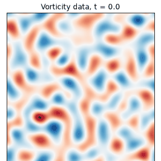
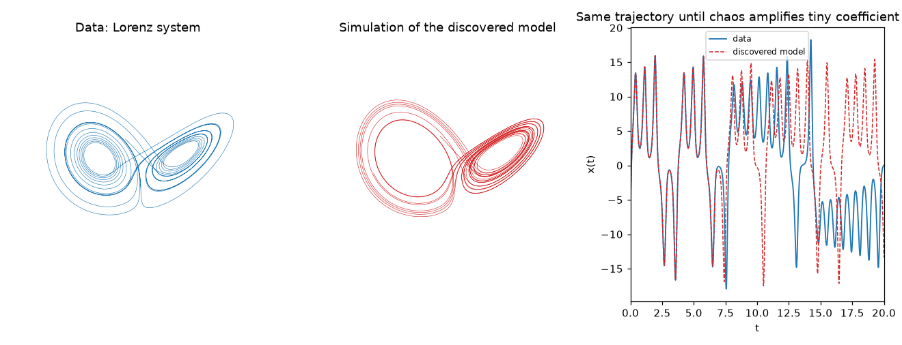
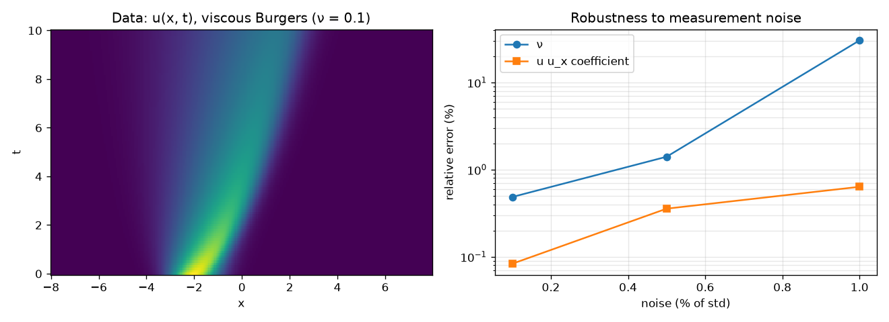
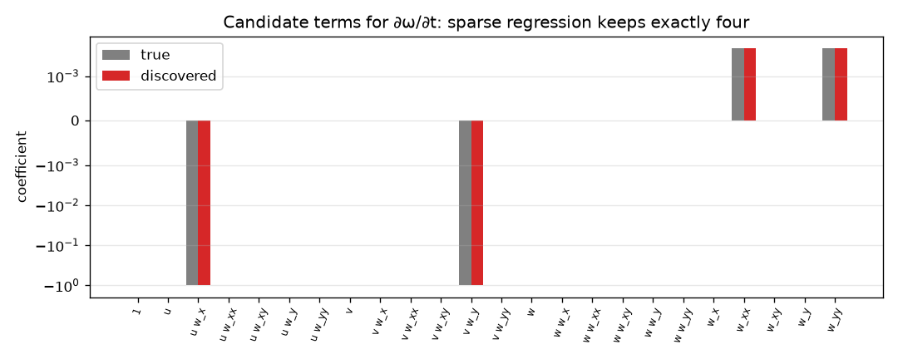

# Data-Driven Equation Discovery: SINDy and PDE-FIND

[](https://github.com/cfdgasman/equation-discovery/actions/workflows/ci.yml)

Governing equations discovered **from data alone** by sparse regression, following Brunton, Proctor & Kutz (**SINDy**, PNAS 2016) and Rudy, Brunton, Proctor & Kutz (**PDE-FIND**, Science Advances 2017). The main demonstration is fluid dynamics: from snapshots of a 2D Navier–Stokes simulation, the method recovers the **vorticity transport equation** and the **viscosity**.

<p align="center">

</p>

```
true   : ω_t = −u ω_x − v ω_y + 0.005 (ω_xx + ω_yy)
found  : ω_t = −0.99986 u ω_x − 0.99980 v ω_y + 0.00500 ω_xx + 0.00500 ω_yy
```

This README walks through **every step**, from the idea to the recovered Navier–Stokes equation. The two warm-up problems (Lorenz, Burgers) introduce the pieces one at a time. Section 4 then runs the full pipeline on Navier–Stokes data and prints what each step produces.

**Contents**

1. [The idea](#1-the-idea)
2. [Warm-up 1: Lorenz system (SINDy, ODE)](#2-warm-up-1-lorenz-system-sindy-ode)
3. [Warm-up 2: Burgers' equation (PDE-FIND, 1D PDE)](#3-warm-up-2-burgers-equation-pde-find-1d-pde)
4. [Navier–Stokes, step by step](#4-navierstokes-step-by-step)
5. [Noise: where it breaks](#5-noise-where-it-breaks)
6. [Code map](#6-code-map)
7. [Usage](#7-usage)

---

## 1. The idea

Suppose the dynamics are **u**<sub>t</sub> = N(**u**, **u**<sub>x</sub>, **u**<sub>xx</sub>, …) and N is a *sparse* combination of simple candidate terms. Then discovering N is a linear regression problem:

$$ \mathbf u_t = \Theta(\mathbf u)\,\boldsymbol\xi,\qquad \Theta = \big[\,1,\ u,\ u^2,\ u_x,\ u\,u_x,\ u_{xx},\ \dots\big],\qquad \boldsymbol\xi \text{ sparse}. $$

Each column of Θ is one candidate term evaluated at every sample point. Each entry of ξ is the coefficient of that term in the equation. Most entries should be zero. The few that survive give an equation you can read, not a black box.

The pipeline is always the same five steps:

```
 data u(x,t) ──► derivatives u_t, u_x, u_xx … ──► library Θ ──► sparse regression ──► equation
   (measure)         (differentiate)             (candidates)     (select + fit)       (validate)
```

The physics you assume is only the choice of candidate terms. The regression decides which terms are present and what their coefficients are.

### Sparse regression algorithms

**STLSQ** (SINDy, `stlsq`):

1. Solve the full least-squares problem Θ ξ ≈ u<sub>t</sub>.
2. Set every coefficient with |ξ<sub>k</sub>| < threshold to zero.
3. Refit least squares on the surviving columns only.
4. Repeat 2–3 until the active set stops changing (at most 20 passes).

**STRidge** (PDE-FIND, `stridge`), used for all PDEs here:

1. **Normalise** each column of Θ to unit 2-norm, so a single threshold means the same thing for every term, whatever its units or magnitude.
2. **Split** the samples at random into 80 % training and 20 % held-out.
3. For a given tolerance, run thresholded **ridge** regression (λ = 10⁻⁵) on the training set (`stridge_once`). Ridge keeps the solves stable when columns are nearly collinear.
4. **Debias**: once the active set is fixed, refit it by plain least squares, so the ridge shrinkage does not bias the coefficients.
5. **Search the tolerance.** Start at 10⁻³ × max|ξ<sub>ridge</sub>|. If the score improves, multiply the tolerance by 1.5, otherwise by 1.1, for 40 trials. The score is

$$ \text{score}(\boldsymbol\xi) = \big\|\mathbf u_t^{\text{test}} - \Theta^{\text{test}}\boldsymbol\xi\big\|_2^2 + \lambda_0\,\|\boldsymbol\xi\|_0,\qquad \lambda_0 = 10^{-3}\,\mathrm{cond}(\Theta), $$

   i.e. held-out error plus a price per active term. The best-scoring ξ is kept.
6. **Undo the normalisation** so the coefficients are returned in physical units.

---

## 2. Warm-up 1: Lorenz system (SINDy, ODE)

The simplest case: no spatial derivatives, only a state vector.

**Step 1 — data.** Integrate ẋ = σ(y − x), ẏ = x(ρ − z) − y, ż = xy − βz with σ = 10, ρ = 28, β = 8/3 from (−8, 8, 27) to t = 20 using `solve_ivp` (RK45, rtol = atol = 10⁻¹²). Sample every Δt = 0.002, which gives 10 000 states. Optionally add Gaussian noise with standard deviation = (noise level) × std(X).

**Step 2 — derivatives.** Clean data use second-order central differences. Noisy data are first smoothed and differentiated with a Savitzky–Golay filter (window 41, quartic).

**Step 3 — library.** All monomials of (x, y, z) up to cubic: 1 + 3 + 6 + 10 = **20 candidate terms**.

**Step 4 — regression.** STLSQ with threshold 0.1, applied to each of the three equations separately.

**Step 5 — validate.** Integrate the discovered model from the same initial state and compare it with the data.

| noise | σ (10) | ρ (28) | β (8/3) | active terms |
|---|---|---|---|---|
| 0 % | 9.999 | 27.992 | 2.6664 | 7 = true |
| 0.1 % | 9.999 | 27.967 | 2.6655 | 7 = true |
| 1 % | 9.990 | 28.005 | 2.6661 | 7 = true |

```
dx/dt = −9.999 x + 9.999 y
dy/dt = 27.992 x − 0.999 y − 1.000 xz
dz/dt = −2.666 z + 1.000 xy
```

<p align="center"></p>

Of the 60 possible coefficients (20 terms × 3 equations), exactly the 7 true ones survive. Simulating the discovered model reproduces the attractor. Individual trajectories separate after a few Lyapunov times, as they must for any chaotic system with coefficients accurate to 10⁻⁴.

---

## 3. Warm-up 2: Burgers' equation (PDE-FIND, 1D PDE)

Now there are spatial derivatives, so the library contains derivative terms and their products with the field.

**Step 1 — data.** Solve u<sub>t</sub> + u u<sub>x</sub> = 0.1 u<sub>xx</sub> on the periodic domain [−8, 8) with initial condition u = exp(−(x + 2)²). The solver is Fourier pseudo-spectral on 256 points (2/3-rule dealiasing of the nonlinear term), integrated by adaptive RK45 (rtol 10⁻¹⁰). Store 101 snapshots on t ∈ [0, 10].

**Step 2 — derivatives.**
- *Clean data:* spectral u<sub>x</sub>, u<sub>xx</sub>, u<sub>xxx</sub> (multiply by (ik)ⁿ in Fourier space), and central differences for u<sub>t</sub>.
- *Noisy data:* fit a degree-5 Chebyshev polynomial on a 13-point window around every point, in x and in t separately, and differentiate the fit analytically (`poly_derivative`). Points within 6 cells of a window edge are dropped.

**Step 3 — library.** {1, u, u²} × {1, u<sub>x</sub>, u<sub>xx</sub>, u<sub>xxx</sub>} = **12 candidate terms**, evaluated at all (x, t) samples.

**Step 4 — regression.** STRidge with automatic tolerance selection (Section 1).

| noise | discovered | error in ν | error in u u<sub>x</sub> coefficient |
|---|---|---|---|
| 0 % | u_t = 0.0996 u_xx − 0.9981 u u_x | 0.35 % | 0.19 % |
| 0.1 % | u_t = 0.1005 u_xx − 0.9992 u u_x | 0.49 % | 0.08 % |
| 0.5 % | u_t = 0.0986 u_xx − 0.9964 u u_x | 1.41 % | 0.36 % |
| 1 % | u_t = 0.0696 u_xx − 1.0064 u u_x + 0.1284 u u_xx − 0.1183 u² u_xx | 30 % ✗ | 0.64 % |

<p align="center"></p>

**Limitation.** The weak point of PDE-FIND is differentiating noisy data twice. Up to 0.5 % noise the local-polynomial derivatives are good enough. At 1 % the error in u<sub>xx</sub> leaks into two spurious diffusive terms (u u<sub>xx</sub>, u² u<sub>xx</sub>) and ν is 30 % off. The standard remedies are denoising (e.g. SVD truncation), weak/integral formulations of SINDy, and more data.

---

## 4. Navier–Stokes, step by step

The target is the 2D incompressible Navier–Stokes equations

$$ \mathbf u_t + (\mathbf u\cdot\nabla)\mathbf u = -\nabla p + \nu\nabla^2\mathbf u,\qquad \nabla\cdot\mathbf u = 0. $$

Pressure is not measured, so we work with vorticity ω = v<sub>x</sub> − u<sub>y</sub>. Taking the curl removes the pressure gradient, and in 2D the vortex-stretching term (ω·∇)**u** vanishes, which leaves

$$ \omega_t = -u\,\omega_x - v\,\omega_y + \nu\,(\omega_{xx} + \omega_{yy}). $$

Recovering this equation, i.e. the structure of the advection term, its coefficient −1, and ν, recovers the incompressible Navier–Stokes momentum equation up to a pressure gradient.

### Step 1 — Generate the data (`data.vorticity_2d`)

| item | value |
|---|---|
| domain | [0, 2π)², periodic |
| grid | 128 × 128 |
| viscosity | ν = 0.005 |
| space | Fourier pseudo-spectral; u = ψ<sub>y</sub>, v = −ψ<sub>x</sub>, with ∇²ψ = −ω solved exactly in Fourier space |
| dealiasing | 2/3 rule on the advection term |
| time | classical RK4, Δt = 2 × 10⁻³ |
| initial vorticity | random phases, Fourier amplitude \|ω̂\| ∝ k⁴ e<sup>−(k/4)²</sup> (peak near k ≈ 6), scaled to max\|ω\| = 3 |
| flow | decaying 2D turbulence; u<sub>rms</sub> falls from 0.158 to 0.062, Re = u<sub>rms</sub> (2π/4)/ν ≈ 50 |

### Step 2 — "Measure" the snapshots

Keep ω, u and v on the full grid at **81 snapshots**, t = 0, 0.1, …, 8. The array has shape 128 × 128 × 81. From here on the solver is forgotten. The regression sees only these arrays.

### Step 3 — Differentiate the data

- ω<sub>x</sub>, ω<sub>y</sub>, ω<sub>xx</sub>, ω<sub>yy</sub>: spectral, exact for this periodic data.
- ω<sub>xy</sub>: spectral y-derivative of the spectral ω<sub>x</sub>.
- ω<sub>t</sub>: second-order central difference across snapshots (Δt = 0.1).

Check against the exact right-hand side: the relative L² error of ω<sub>t</sub> is **0.16 %** in the interior snapshots. This is the dominant error in the whole pipeline. Every later step inherits it, and it sets the floor on how well the regression can fit.

### Step 4 — Build the candidate library

Every combination of a "base" factor and a derivative factor gives **24 candidate terms**:

| × | 1 | ω<sub>x</sub> | ω<sub>y</sub> | ω<sub>xx</sub> | ω<sub>xy</sub> | ω<sub>yy</sub> |
|---|---|---|---|---|---|---|
| **1** | 1 | ω<sub>x</sub> | ω<sub>y</sub> | ω<sub>xx</sub> | ω<sub>xy</sub> | ω<sub>yy</sub> |
| **ω** | ω | ω ω<sub>x</sub> | ω ω<sub>y</sub> | ω ω<sub>xx</sub> | ω ω<sub>xy</sub> | ω ω<sub>yy</sub> |
| **u** | u | u ω<sub>x</sub> | u ω<sub>y</sub> | u ω<sub>xx</sub> | u ω<sub>xy</sub> | u ω<sub>yy</sub> |
| **v** | v | v ω<sub>x</sub> | v ω<sub>y</sub> | v ω<sub>xx</sub> | v ω<sub>xy</sub> | v ω<sub>yy</sub> |

The library includes wrong-direction advection (u ω<sub>y</sub>, v ω<sub>x</sub>), the cross derivative ω<sub>xy</sub>, nonlinear diffusion (ω ω<sub>xx</sub>, …), linear damping (ω) and source terms (1, u, v). The regression has to reject all of them.

### Step 5 — Sample space–time points

The full grid has 128² × 77 ≈ 1.26 million interior points. We draw **40 000 random (x, y, t) points** (the two snapshots at each end are excluded because of the time stencil). This gives a regression problem Θ ξ ≈ ω<sub>t</sub> with Θ of size **40 000 × 24**.

### Step 6 — Plain least squares: accurate but not sparse

Solving Θ ξ = ω<sub>t</sub> by ordinary least squares already puts the largest weights on the right terms:

```
u ω_x  −0.9998     v ω_y  −0.9997     ω_yy  +0.004993     ω_xx  +0.004993
ω      −1.5e−4     v      −9.1e−5     v ω_yy  +2.4e−5     u  −2.1e−5    … (all 24 non-zero)
```

The fit is not an equation, though. **All 24 coefficients are non-zero.** The 20 spurious ones are small (10⁻⁴ to 10⁻⁸) and just fit the derivative error. Their presence also pulls ν 0.14 % low. A threshold is needed, and the right threshold depends on the scale of each column.

### Step 7 — Normalise the columns

Column norms differ by orders of magnitude (ω<sub>xx</sub> is much larger than u, for example). Dividing each column by its 2-norm reduces the condition number of Θ from **411 to 4.4**. After normalisation one tolerance applies equally to every term. The ℓ₀ penalty is λ₀ = 10⁻³ × cond = 4.4 × 10⁻³.

### Step 8 — Threshold: watch the equation appear

Running one STRidge pass (`stridge_once`) at increasing tolerance on the normalised coefficients shows how the active set shrinks:

| tolerance | active terms | result |
|---|---|---|
| 10⁻⁴ | 22 | nearly everything survives |
| 10⁻³ | 15 | the four true terms plus 11 small ones |
| 10⁻² | 5 | true terms + a spurious damping −0.0002 ω |
| 10⁻¹ | **4** | ω<sub>t</sub> = −0.9999 u ω<sub>x</sub> − 0.9998 v ω<sub>y</sub> + 0.0050 ω<sub>xx</sub> + 0.0050 ω<sub>yy</sub> |
| 1, 10 | 4 | unchanged: a wide plateau |

The four-term model survives across two decades of tolerance. That plateau is the signature of a real sparse structure rather than an artefact of the threshold.

### Step 9 — Select the model automatically

The tolerance search from Section 1 scores every candidate on the 20 % held-out samples (8 000 points; score = held-out squared error + λ₀ × number of terms):

| model | held-out error | + ℓ₀ penalty | score |
|---|---|---|---|
| 5 terms (true + ω) | 3.93 × 10⁻⁴ | 5 × 4.4 × 10⁻³ | 2.25 × 10⁻² |
| **4 terms (true)** | 4.05 × 10⁻⁴ | 4 × 4.4 × 10⁻³ | **1.81 × 10⁻²** |
| 3 terms, drop ω<sub>xx</sub> or ω<sub>yy</sub> | ≈ 30 | | ≈ 30 |
| 3 terms, drop u ω<sub>x</sub> or v ω<sub>y</sub> | ≈ 105 | | ≈ 105 |

The extra ω term lowers the held-out error by only 3 %, far less than its price. Dropping any true term raises the error by five orders of magnitude. So the search picks the 4-term model without any hand tuning.

### Step 10 — Debias and return to physical units

Refit the four surviving columns by plain least squares on the training set, and divide by the column norms:

```
true   : ω_t = −u ω_x − v ω_y + 0.005 (ω_xx + ω_yy)
found  : ω_t = −0.99986 u ω_x − 0.99980 v ω_y + 0.00500 ω_xx + 0.00500 ω_yy
```

<p align="center"></p>

### Step 11 — Validate

| check | result |
|---|---|
| active set | exactly {u ω<sub>x</sub>, v ω<sub>y</sub>, ω<sub>xx</sub>, ω<sub>yy</sub>}; 20 of 24 candidates rejected |
| advection coefficients | −0.99986, −0.99980 (error ≤ 0.02 %) |
| viscosity | 0.00500 (error **0.09 %**) |
| isotropy | coefficients of ω<sub>xx</sub> and ω<sub>yy</sub> equal, ω<sub>xy</sub> rejected → the operator is the Laplacian ν∇²ω |
| residual | relative residual 0.158 % for the 4-term model vs 0.154 % for the full 24-term least squares. The 20 extra terms buy almost nothing, and both equal the 0.16 % error of the ω<sub>t</sub> estimate from Step 3 |

The residual matches the derivative-error floor, so the discovered model explains everything the data can resolve. Putting the result back into the curl of the momentum equation gives

$$ \mathbf u_t + (\mathbf u\cdot\nabla)\mathbf u = -\nabla p + 0.00500\,\nabla^2\mathbf u, $$

i.e. the incompressible Navier–Stokes equations with the correct viscosity, identified from snapshots alone.

---

## 5. Noise: where it breaks

The same Navier–Stokes pipeline with Gaussian noise added to ω, u and v (standard deviation = level × field std), still using spectral derivatives:

| noise | discovered | verdict |
|---|---|---|
| 0 % | −0.99986 u ω<sub>x</sub> − 0.99980 v ω<sub>y</sub> + 0.00500 ∇²ω | exact structure, ν to 0.09 % |
| 0.1 % | −0.9966 u ω<sub>x</sub> − 0.9962 v ω<sub>y</sub> + 0.0049 ∇²ω − 0.0045 ω | ν to 2 %, one spurious damping term |
| 1 % | 18 active terms, ν = 0.0014 | ✗ fails |

Spectral differentiation multiplies the noise at wavenumber k by k², so at 1 % noise the second derivatives are dominated by noise and the regression cannot separate diffusion from spurious terms. This matches the Burgers result in Section 3. Making the NS case noise-robust needs the same remedies: local polynomial or filtered derivatives, SVD denoising, or a weak formulation that integrates the equation against test functions instead of differentiating the data.

---

## 6. Code map

| step | file | function |
|---|---|---|
| data: Lorenz, Burgers, 2D NS | [`discovery/data.py`](discovery/data.py) | `lorenz`, `burgers`, `vorticity_2d` |
| derivatives | [`discovery/derivatives.py`](discovery/derivatives.py) | `spectral`, `central_difference`, `poly_derivative` |
| libraries | [`discovery/sparse_regression.py`](discovery/sparse_regression.py), [`discovery/pde.py`](discovery/pde.py) | `polynomial_library`, `burgers_library`, `vorticity_library` |
| sparse regression | [`discovery/sparse_regression.py`](discovery/sparse_regression.py) | `stlsq`, `stridge_once`, `stridge` |
| printing | [`discovery/sparse_regression.py`](discovery/sparse_regression.py) | `format_equation` |
| studies and figures | [`run.py`](run.py) | `lorenz`, `burgers`, `navier_stokes` |
| tests | [`tests/test_discovery.py`](tests/test_discovery.py) | spectral derivative, STLSQ, Lorenz, Burgers, vorticity equation |

## 7. Usage

```bash
pip install -r requirements.txt
python run.py     # all three studies, figures and GIF (~2 min)
pytest            # spectral derivative, STLSQ, Lorenz, Burgers, vorticity equation
```

## References

S. L. Brunton, J. L. Proctor, J. N. Kutz, *Discovering governing equations from data by sparse identification of nonlinear dynamical systems*, PNAS 113 (2016) 3932–3937.
S. H. Rudy, S. L. Brunton, J. L. Proctor, J. N. Kutz, *Data-driven discovery of partial differential equations*, Science Advances 3 (2017) e1602614.
S. L. Brunton, J. N. Kutz, *Data-Driven Science and Engineering*, 2nd ed., Cambridge University Press, 2022.

## License

MIT
